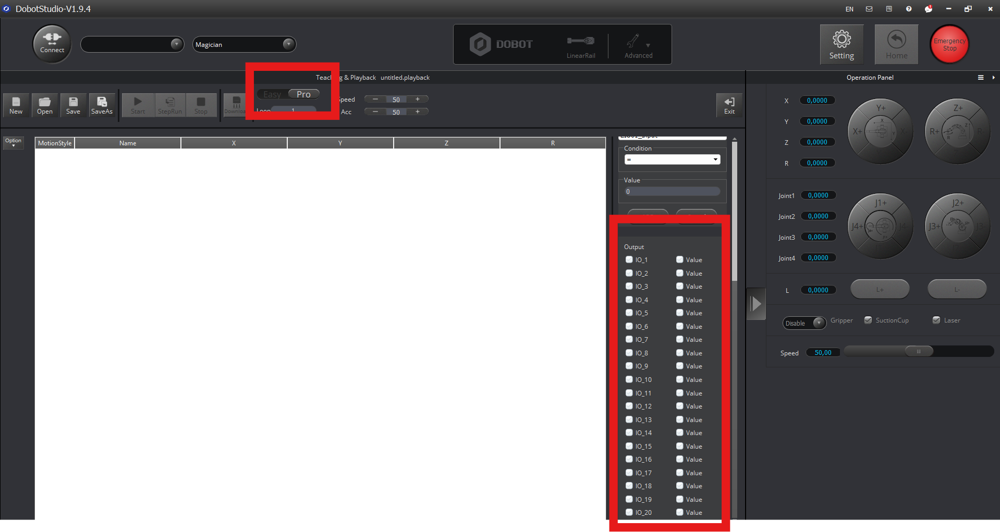

# Dobot Magician GPIO Sample Script

Dieses Skript zeigt, wie man einen Dobot-Magician mit der Dobot-API in Python steuert. Das Skript stellt eine Verbindung zum Dobot her, löscht vorherige Befehle, setzt die Home-Parameter und bewegt den Roboterarm durch eine Reihe von Koordinaten auf den X-, Y- und Z-Achsen sowie dem Sliding-Rail-Kit. Zusätzlich wird demonstriert, wie man die Klemmvorrichtung der Tubes mittels dem GPIO verwendet.

## Voraussetzungen

- Python 3.x
- Dobot Link v6.7.3
- Dobot API Python-Bibliothek
- Dobot-Magician
- [optional] Dobot Studio **v1.9.4**

## Einrichtung

### Installieren der Dobot API:

Stellen Sie sicher, dass die Dobot API auf Ihrem System installiert und richtig konfiguriert ist. Sie können die Dobot API von der offiziellen Dobot-Website oder von den mitgelieferten Installationsmedien herunterladen.

### Verwendung ohne Pythonscript

**WICHTIG** - Dobot Studio v1.9.4\
Nur in dieser Version ist die TeachIn-Ansteuerung des GPIOs möglich!

Alternativ kann die vorliegende Funktion mittels der Teach & Plackback Funktion in Dobot Studio realisiert werden. Dazu können die Verfahrpunkte einfach eingeteacht werden. Bzgl. dem Ansteuern der Klemmvorrichtung mittels dem GPIO lassen sich über die "Pro" Ansicht Outputpins zu den jeweiligen Befehlen hinzufügen und mit einem Output-Wert versehen. Der für die Funktion vorgesehene Pin ist EIO_17, welche auf HIGH/1 schaltet.

1. TeachIn-Lab

2. Pro-Steuerung anwählen und Pins schalten

Datum: 16.08.2024\
Autor: Mark Lattwein